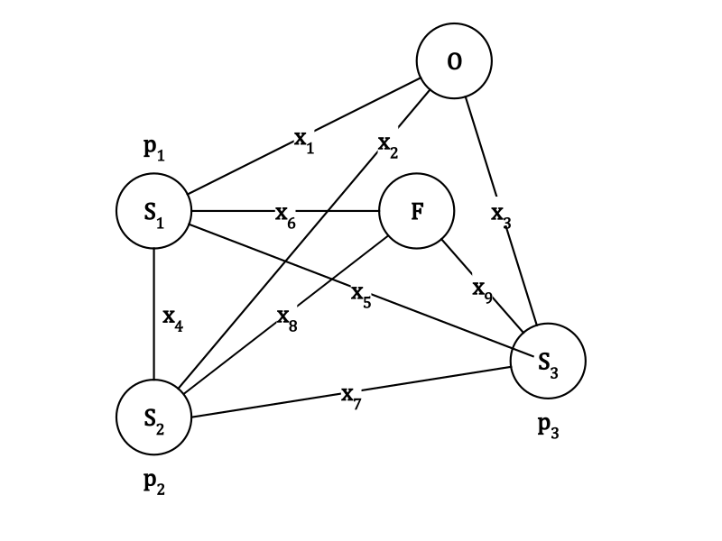
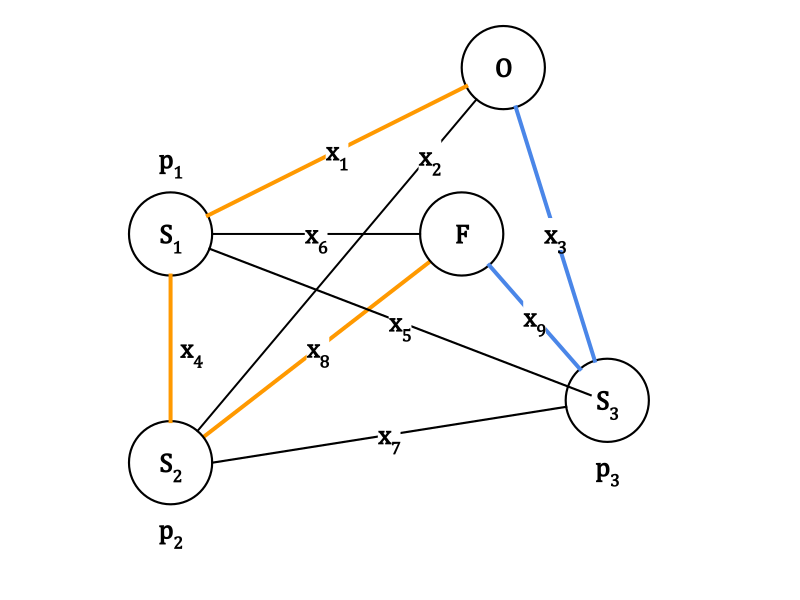
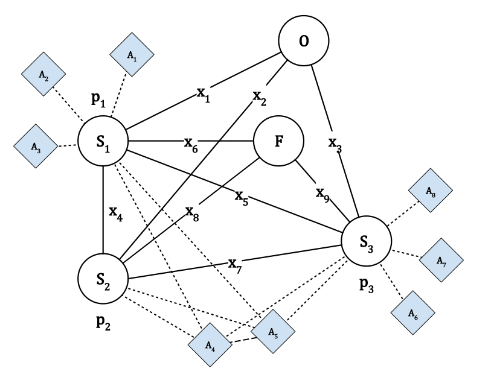
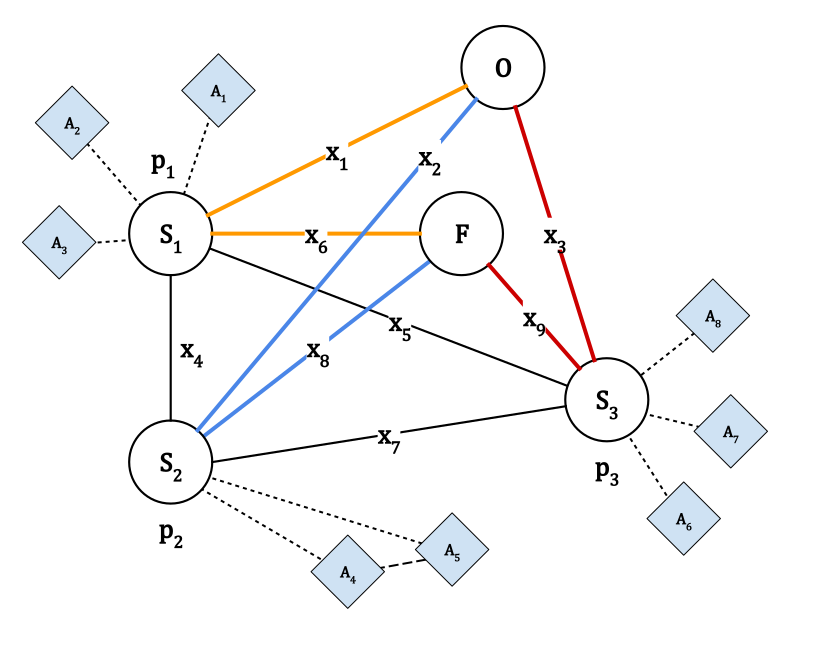

# Linear Programming Lab
By Denada Bakiasi & Luis Daniel Casais Mezquida  
Heuristics 22/23  
Bachelor's Degree in Computer Science and Engineering, grp. 89  
Universidad Carlos III de Madrid

## Problem statement
A problem the management board of some schools must solve each year is the organization of the school bus routes. Specifically, the board of one school has contacted the students of the Heuristics and Optimization course to solve several problems related to the school bus routes design.

### Part 1: Basic Modeling with LibreOffice Calc
The first problem the school board wants to solve is the generation of the routes the buses must follow to pick up the students in their assigned stops and drive them to school.



Figure 1 shows the problem we must solve. All buses responsible for the school routes leave every morning from the parking. Each of these buses picks up the students from their assigned stops and drives them to the school. Figure 1 shows a graph where each vertex represents a different location: the parking (vertex with buses), the school (vertex with the building), and the different stops. In our case there are three stops (S1, S2 and S3). The green numbers on each stop represent the number of students that take the bus to school in that stop. So, 15 students take the bus at stop S1, 5 students take the bus at stop S2 and 10 students take the bus at stop S3. The edges of the graph represent to streets to move from one location to another. Alongside each edge a number shows the distance between the locations in km. So we know that the distance between stops S2 and S3 is 5km, the distance between stop S3 and the school is 4km, and so on. The figure only shows streets that can be used to go from one location to the other. On the other hand, the school can only use three buses to follow the routes and pick up the students (in general, the maximum number of buses that can be used is the number of stops). All buses have the same capacity, which is 20 students.  
Any solution must comply with the following constraints:
- Each stop is visited by a single route.
- From each stop only one route can exit.
- The number of routes cannot be greater than the number of available buses.
- All routes start from the parking and end at the school. Thus, the number of routes starting at the parking must be the same as the number of routes finishing at the school. In the example two routes exit the school and they both finish at the school.
- The flow of students from location X to location Y (number of students going from X to Y ) cannot be greater than the bus capacity if there is a route that goes from X to Y . If there is no route between two locations, the flow of students must be zero.

The school board is interested in designing the school bus routes in order to minimize the cost associated with them. Each bus used adds a cost of $120€$. Additionally, to this cost we must add the gas cost, which is 5e/km. Thus, considering the solution show in Figure 1 (red and blue routes) the total cost would be $120 × 2 + 5 × (8 + 6 + 10 + 5 + 7) = 420€$. These routes form a solution that is not necessarily optimal.  
The find the optimal solution you must:
1. Model the problem as a Integer Lineal Programming task ([Modelling P1](#modelling-p1)).
2. Implement and solve the model in a spreadsheet (`part-1/exercise1lab.ods`).

### Modelling P1
Set of stops:  
$S=\{O,\ S_1,\ S_2,\ S_3,\ F\}$  
Set of stops with passengers:  
$P=\{S_1,\ S_2,\ S_3\}$  
**Decision variable** - edge between stop $i$ and stop $j$:  
$E_{ij}=\{0,1\};\ i,\ j \in S$  
**Decision variable** - flux between stop $i$ and stop $j$:  
$F_{ij}\in F;\ i,\ j \in S$  
$F_{ij}\in \mathbb{N};\ F\in P \times P$  
Students in stop $k$:  
$p_k\in \mathbb{N};\ k \in P$  
Cost of edge $k$:  
$a_k\in \mathbb{N};\ k \in [1,9]\subset \mathbb{N}$  
Cost of going from i to j:  
$C_{ij} \in \mathbb{N}$  
$C_{ij}= \infty$ iff there is no edge from $i$ to $j$  
$C \in P \times P$  
<!--
$C=\begin{bmatrix}
\infty & a_1 & a_2 & a_3 & \infty \\
\infty & \infty & a_4 & a_5 & a_6 \\
\infty & a_4 & \infty & a_7 & a_8 \\
\infty & a_5 & a_7 & \infty & a_9 \\
\infty & \infty & \infty & \infty & \infty \\
\end{bmatrix}
$  
-->
<!-- Thanks to https://editor.codecogs.com/ -->
Cost per bus:  
$b\in \mathbb{N}$  
Cost per km:  
$c\in \mathbb{N}$  
Capacity of each bus:  
$d\in \mathbb{N}$  

---
Formalization:  

$min\ Z = c\cdot \sum_{i,j\in S} C_{ij}\cdot E_{ij} + b\cdot \sum_{j\in S}E_{Oj}$  
$s.t.$  
$(1)\ \forall i \in P,\ \sum_{k\in S}E_{ik}=1$  
$(2)\ \forall j \in P,\ \sum_{k\in S}E_{kj}=1$  
$(3)\ \sum_{j\in S}E_{Oj}=\sum_{i\in S}E_{iF}$  
$(4)\ \forall i\in P,\ \sum_{k\in S}F_{ik}=p_i+\sum_{j\in P}F_{ji}$  
$(5)\ \forall i,j\in S,\ F_{ij} \leq d\cdot E_{ij}$  
$(I)\ F_{ij} \geq 0;\ i,j\in S;\ F_{ij}\in \mathbb{N}$  

#### Solution P1
The solution is $Z^{*} = 400$:



### Part 2: Advanced modeling with GLPK
In addition to the route optimization problem defined in Part 1, the school board thinks the transport cost can be reduced even more if the stops the students are assigned to could be changed. For this, they have defined the different stops each student could walk to, considering that the distance between their house and a possible stop cannot be greater than a fixed distance.  
Figure 2 shows an example of the new problem for 8 students. The capacity of the buses is now 4 students. The dotted lines represent the stops each student can walk to. More specifically:
- Stop $S_1$ can be used by the students $A_1$, $A_2$, $A_3$, $A_4$ and $A_5$.
- Stop $S_2$ can be used by the students $A_4$ and $A_5$.
- Stop $S_3$ can be used by the students $A_4$, $A_5$, $A_6$, $A_7$ and $A_8$.

The school board has family information for each student, so they can easily determine if a group of students are siblings. If a group of students are siblings, the must always be assigned to the same stop. In this example, $A_4$ and $A_5$ are siblings. Since siblings must be assigned to the same stop and the number of students in one stop cannot be greater than the bus capacity, $A_4$ and $A_5$ must be assigned to $S_2$. If they weren’t siblings, one could be assigned to $S_1$ and the other to $S_2$, making a trip to $S_2$ not mandatory.



The new solution must determine both the routes as the bus stop assigned to each student.  
You must:
- Model the problem described in part 2 as a Linear Programming task. To do this, take the model from Part 1 and make the necessary modifications ([Modelling P2](#modelling-p2)).
- Implement the model from Part 1 in MathProg. This model will help you get familiar with MathProg’s syntax before implementing the model from Part 2. The model for Part 1 must be general enough to allow solving problems different from the one shown in 1 with the least possible modifications. In fact, these modifications should be carried out in the data file `part-1/data.dat`, without making any modifications to the model file `part-1/model.mod`.
- Once the model from Part 1 has been implemented in MathProg, it is request to perform the necessary modifications to include the problem described in Part 2. Again, the model for Part 2 (`part-1/model.mod`) must be general enough to allow solving problems different than the one in Figure 2 by changing `part-2/data.dat`.

### Modelling P2
Set of stops:  
$S=\{O,\ S_1,\ S_2,\ S_3,\ F\}$  
Set of stops with passengers:  
$P=\{S_1,\ S_2,\ S_3\}$  
**Decision variable** - edge between stop $i$ and stop $j$:  
$E_{ij}=\{0,1\};\ i,\ j \in S$  
**Decision variable** - flux between stop $i$ and stop $j$:  
$F_{ij}\in F;\ i,\ j \in S$  
$F_{ij}\in \mathbb{N};\ F\in P \times P$  
Students in stop $k$:  
$p_k\in \mathbb{N};\ k \in P$  
Cost of edge $k$:  
$a_k\in \mathbb{N};\ k \in [1,9]\subset \mathbb{N}$  
Cost of going from i to j:  
$C_{ij} \in \mathbb{N}$  
$C_{ij}= \infty$ iff there is no edge from $i$ to $j$  
$C \in P \times P$  
<!--
$C=
\begin{bmatrix}
\infty & a_1 & a_2 & a_3 & \infty \\
\infty & \infty & a_4 & a_5 & a_6 \\
\infty & a_4 & \infty & a_7 & a_8 \\
\infty & a_5 & a_7 & \infty & a_9 \\
\infty & \infty & \infty & \infty & \infty \\
\end{bmatrix}
$  
-->
<!-- Thanks to https://editor.codecogs.com/ -->
Cost per bus:  
$b \in \mathbb{N}$  
Cost per km:  
$c \in \mathbb{N}$  
Capacity of each bus:  
$d \in \mathbb{N}$  
Set of students:  
$H=\{A_1,\ A_2,\ A_3,\ A_4,\ A_5,\ A_6,\ A_7,\ A_8\}$  
Possible stops $j$ for each student $i$:  
$G_{ij} \in \{0,1\}$  
$G \in H \times P$  
**Decision variable** - possible stops $j$ for each student $i$:  
$M_{ij}\in \{0,1\}$  
$M \in H \times P$  
Student $i$ is sibling of student $j$:  
$R_{ij}\in \{0,1\}$  
$R \in H \times H$  


---
Formalization:  

$min\ Z = c\cdot \sum_{i,j\in S} C_{ij}\cdot E_{ij} + b\cdot \sum_{j\in S}E_{Oj}$  
$s.t.$  
$(1)\ \forall i \in P,\ \sum_{k\in S}E_{ik}=1$  
$(2)\ \forall j \in P,\ \sum_{k\in S}E_{kj}=1$  
$(3)\ \sum_{j\in S}E_{Oj}=\sum_{i\in S}E_{iF}$  
$(4)\ \forall i\in P,\ \sum_{k\in S}F_{ik}=\sum_{l \in H}{M_{li}}+\sum_{j\in P}F_{ji}$  
$(5)\ \forall i,j \in S,\ F_{ij} \leq d\cdot E_{ij}$  
$(6)\ \forall i \in H,\ \forall j \in P,\ M_{ij} \leq G_{ij}$  
$(7)\ \forall k \in H,\ \sum_{j \in P}M_{kj} = 1$  
$(8)\ \forall k \in P,\ \forall i,j \in H,\ R_{ij} \cdot (M_{ik} - M_{jk}) = 0$  
$(I)\ F_{ij} \geq 0;\ i,j\in S;\ F_{ij}\in \mathbb{N}$  
$(II)\ M_{ij} \geq 0;\ i \in H,\ j\in P;\ M_{ij}\in \{0,1\}$  

#### Solution P2
The solution is $Z^* = 585$:


### Part 3: Analysis of the results
All results obtained in the previous sections have to be analyzed in this section. The solutions obtained must be described (verifying that all constraints from the statement are met).

## Execution
First install Matprog (GLP).
```
sudo apt install glpk-utils
```

To run the program (eg. part 2):
```
cd part-2/
glpsol -m model.mod -d data.dat -o out.txt
```
